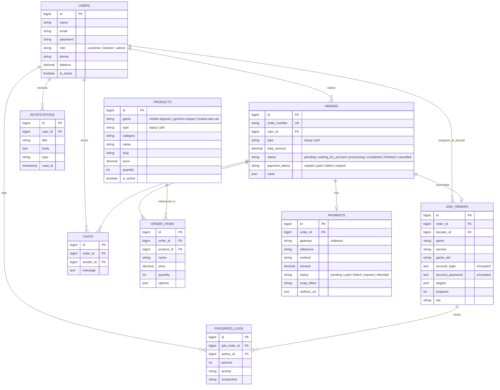

# Verand Store — Entity Relationship Diagram (ERD)

Diagram relasi entitas basis data untuk sistem Verand Store.

```mermaid
erDiagram
    USERS ||--o{ ORDERS : "makes"
    USERS ||--o{ JOKI_ORDERS : "assigned_as_booster"
    USERS ||--o{ PROGRESS_LOGS : "logs"
    USERS ||--o{ CHATS : "sends"
    USERS ||--o{ NOTIFICATIONS : "receives"

    ORDERS ||--|{ ORDER_ITEMS : "contains"
    ORDERS ||--o| PAYMENTS : "has"
    ORDERS ||--o| JOKI_ORDERS : "associates"
    ORDERS ||--o{ CHATS : "hosts"

    PRODUCTS ||--o{ ORDER_ITEMS : "referenced_in"
    JOKI_ORDERS ||--o{ PROGRESS_LOGS : "tracks"

    USERS {
        bigint id PK
        string name
        string email
        string password
        string role "customer | booster | admin"
        string phone
        decimal balance
        boolean is_active
    }

    PRODUCTS {
        bigint id PK
        string game "mobile-legends | genshin-impact | honkai-star-rail"
        string type "topup | joki"
        string category
        string name
        string slug
        decimal price
        int quantity
        boolean is_active
    }

    ORDERS {
        bigint id PK
        string order_number UK
        bigint user_id FK
        string type "topup | joki"
        decimal total_amount
        string status "pending | waiting_for_account | processing | completed | finished | cancelled"
        string payment_status "unpaid | paid | failed | expired"
        json meta
    }

    ORDER_ITEMS {
        bigint id PK
        bigint order_id FK
        bigint product_id FK
        string name
        decimal price
        int quantity
        json options
    }

    PAYMENTS {
        bigint id PK
        bigint order_id FK
        string gateway "midtrans"
        string reference
        string method
        decimal amount
        string status "pending | paid | failed | expired | refunded"
        string snap_token
        text redirect_url
    }

    JOKI_ORDERS {
        bigint id PK
        bigint order_id FK
        bigint booster_id FK
        string game
        string service
        string game_uid
        text account_login "encrypted"
        text account_password "encrypted"
        json targets
        int progress
        string eta
    }

    PROGRESS_LOGS {
        bigint id PK
        bigint joki_order_id FK
        bigint author_id FK
        int percent
        string activity
        string screenshot
    }

    CHATS {
        bigint id PK
        bigint order_id FK
        bigint sender_id FK
        text message
    }

    NOTIFICATIONS {
        bigint id PK
        bigint user_id FK
        string title
        text body
        string type
        timestamp read_at
    }
```
