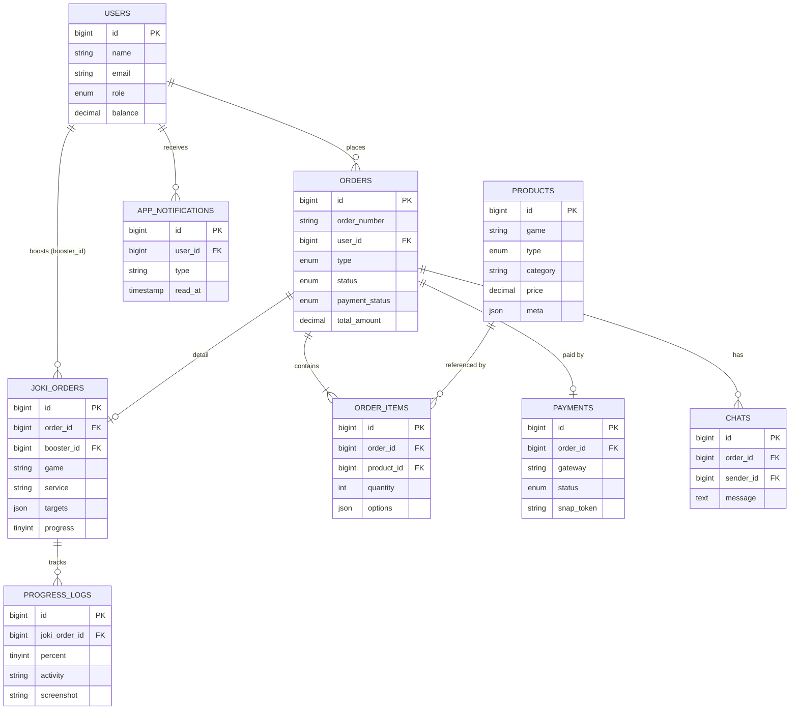

# ERD — Verand Store

```mermaid
erDiagram
    USERS ||--o{ ORDERS : places
    USERS ||--o{ APP_NOTIFICATIONS : receives
    USERS ||--o{ JOKI_ORDERS : "boosts (booster_id)"
    ORDERS ||--|{ ORDER_ITEMS : contains
    ORDERS ||--o| PAYMENTS : "paid by"
    ORDERS ||--o| JOKI_ORDERS : "detail"
    ORDERS ||--o{ CHATS : has
    PRODUCTS ||--o{ ORDER_ITEMS : "referenced by"
    JOKI_ORDERS ||--o{ PROGRESS_LOGS : tracks

    USERS {
        bigint id PK
        string name
        string email
        enum role
        decimal balance
    }
    PRODUCTS {
        bigint id PK
        string game
        enum type
        string category
        decimal price
        json meta
    }
    ORDERS {
        bigint id PK
        string order_number
        bigint user_id FK
        enum type
        enum status
        enum payment_status
        decimal total_amount
    }
    ORDER_ITEMS {
        bigint id PK
        bigint order_id FK
        bigint product_id FK
        int quantity
        json options
    }
    PAYMENTS {
        bigint id PK
        bigint order_id FK
        string gateway
        enum status
        string snap_token
    }
    JOKI_ORDERS {
        bigint id PK
        bigint order_id FK
        bigint booster_id FK
        string game
        string service
        json targets
        tinyint progress
    }
    PROGRESS_LOGS {
        bigint id PK
        bigint joki_order_id FK
        tinyint percent
        string activity
        string screenshot
    }
    CHATS {
        bigint id PK
        bigint order_id FK
        bigint sender_id FK
        text message
    }
    APP_NOTIFICATIONS {
        bigint id PK
        bigint user_id FK
        string type
        timestamp read_at
    }
```
