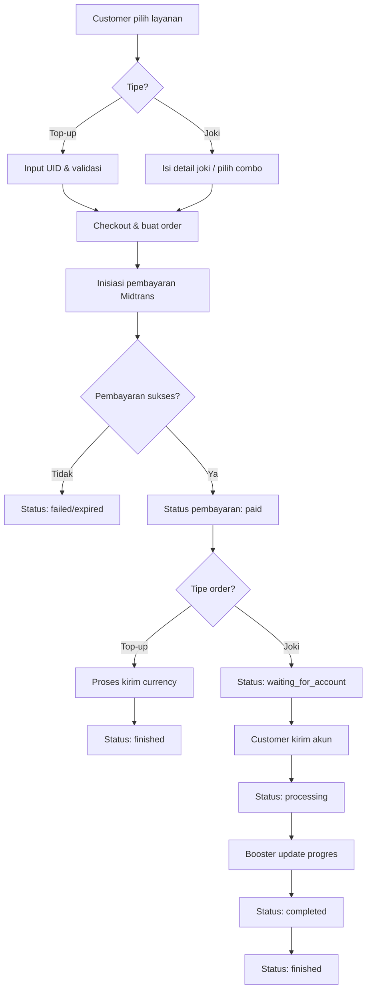

# Flowchart — Alur Pesanan

```mermaid
flowchart TD
    A[Customer pilih layanan] --> B{Tipe?}
    B -- Top-up --> C[Input UID & validasi]
    B -- Joki --> D[Isi detail joki / pilih combo]
    C --> E[Checkout & buat order]
    D --> E
    E --> F[Inisiasi pembayaran Midtrans]
    F --> G{Pembayaran sukses?}
    G -- Tidak --> H[Status: failed/expired]
    G -- Ya --> I[Status pembayaran: paid]
    I --> J{Tipe order?}
    J -- Top-up --> K[Proses kirim currency] --> L[Status: finished]
    J -- Joki --> M[Status: waiting_for_account]
    M --> N[Customer kirim akun] --> O[Status: processing]
    O --> P[Booster update progres] --> Q[Status: completed]
    Q --> R[Status: finished]
```
