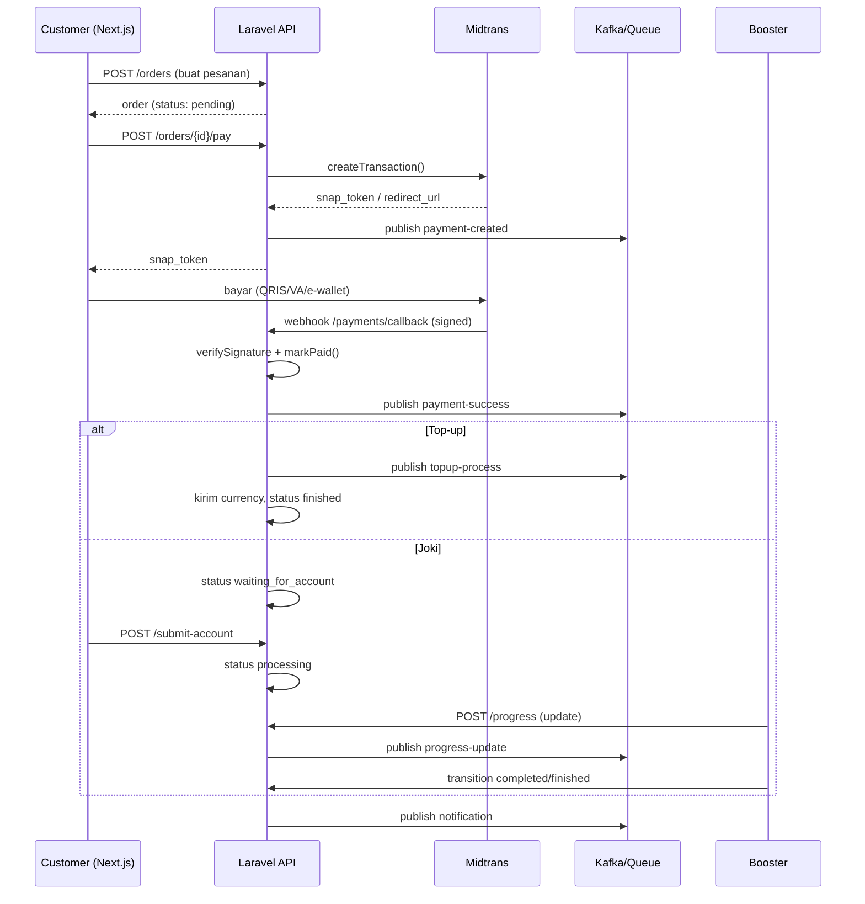

# Sequence Diagram — Pembayaran & Pemrosesan

```mermaid
sequenceDiagram
    participant C as Customer (Next.js)
    participant API as Laravel API
    participant MT as Midtrans
    participant Q as Kafka/Queue
    participant B as Booster

    C->>API: POST /orders (buat pesanan)
    API-->>C: order (status: pending)
    C->>API: POST /orders/{id}/pay
    API->>MT: createTransaction()
    MT-->>API: snap_token / redirect_url
    API->>Q: publish payment-created
    API-->>C: snap_token
    C->>MT: bayar (QRIS/VA/e-wallet)
    MT->>API: webhook /payments/callback (signed)
    API->>API: verifySignature + markPaid()
    API->>Q: publish payment-success
    alt Top-up
        API->>Q: publish topup-process
        API->>API: kirim currency, status finished
    else Joki
        API->>API: status waiting_for_account
        C->>API: POST /submit-account
        API->>API: status processing
        B->>API: POST /progress (update)
        API->>Q: publish progress-update
        B->>API: transition completed/finished
    end
    API->>Q: publish notification
```
